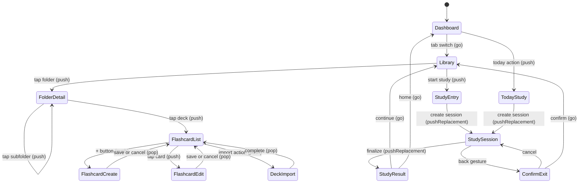

# Navigation Flow

## Source files to inspect

- `lib/app/router/app_router.dart`
- `lib/app/router/route_names.dart`
- `lib/presentation/features/**/routes/*.dart`
- `lib/app/app_shell.dart`

## Router contract

- Use GoRouter.
- Use existing `RouteNames` and `RoutePaths`.
- Do not hardcode route strings in widgets.
- Add route constants before adding new routes.
- Keep shell navigation visibility correct.

## Top-level destinations

| Path | Responsibility | Shell visible |
| --- | --- | --- |
| `/home` | Dashboard | Yes |
| `/library` | Library | Yes |
| `/progress` | Progress | Yes |
| `/settings` | Settings hub | Yes |

## Settings routes

| Path | Responsibility | Shell visible |
| --- | --- | --- |
| `/settings/account` | Account linking + Drive sync | No |
| `/settings/learning` | Study defaults | No |
| `/settings/learning/tags` | Tag management (new; see `docs/business/tags/tag-system.md` and wireframe `docs/wireframes/22-settings-tag-management.md`) | No |
| `/settings/audio-speech` | TTS settings | No |

Route name constants (from `lib/app/router/route_names.dart`): `RouteNames.settings`, `RouteNames.settingsAccount`, `RouteNames.settingsLearning`, `RouteNames.settingsAudioSpeech`. Path segment constants: `RoutePaths.settingsAccountSegment`, `RoutePaths.settingsLearningSegment`, `RoutePaths.settingsAudioSpeechSegment`. Tag management route constants (`RouteNames.settingsLearningTags`, `RoutePaths.settingsLearningTagsSegment`) are new and MUST be added when the route is wired.

## Library routes

| Route responsibility | Route pattern | Shell visible |
| --- | --- | --- |
| Folder detail | `/library/folder/:id` | Yes |
| Flashcard list | `/library/deck/:deckId/flashcards` | Yes |
| Flashcard list (filtered) | `/library/deck/:deckId/flashcards?filter={active\|suspended\|buried\|due}&tag={t1,t2}` | Yes |
| Flashcard create | `/library/deck/:deckId/flashcards/new` | No |
| Flashcard edit | `/library/deck/:deckId/flashcards/:flashcardId/edit` | No |
| Flashcard history | `/library/deck/:deckId/flashcards/:flashcardId/history` | No |
| Deck import | `/library/deck/:deckId/import` | No |
| Library search | `/library/search?q={query}` | Yes |
| Study entry | `/library/study/:entryType/:entryRefId` (entryType: `deck` \| `folder` \| `tag`) | No |
| Today study | `/library/study/today` | No |
| Study session | `/library/study/session/:sessionId` | No |
| Study result | `/library/study/session/:sessionId/result` | No |

Notes:

- Query-string filters on the flashcard list are application conventions; verify GoRouter declarations in `lib/presentation/features/**/routes/*.dart`.
- The `tag` entry type, history route, and library search route are new. Add route constants in `RouteNames` / `RoutePaths` and wire them up when implementing.

## Push vs Go rules

| Scenario | Method | Reason |
| --- | --- | --- |
| Folder → subfolder | `push` | Need back stack |
| Folder → deck flashcards | `push` | Need back |
| Flashcard list → create | `push` | Return result |
| Flashcard list → edit | `push` | Return result |
| Deck → import | `push` | Return result |
| Settings hub → sub-screen (account/learning/audio-speech) | `push` | Need back to hub |
| Bottom nav switch | `go` | Reset tab stack |
| Study entry → session | `pushReplacement` | No back into entry screen |
| Session → result | `pushReplacement` | Session is done, do not stack |
| Result → origin | `go` | Reset, do not stack result |
| Invalid route | `go` to safe route | Recover, do not stack error |

## Navigation flow diagram

## Navigation behavior

- Library opens root content.
- Folder detail opens child folders or decks.
- Deck opens flashcard list.
- Flashcard create/edit returns to flashcard list.
- Import returns to deck/folder context.
- Study entry creates or resumes persisted session.
- Study session route protects accidental exit.
- Study result returns to relevant origin when available.

## Invalid route behavior

When params are invalid or entity is deleted:

- Show shared error state (`MxErrorState`).
- Do not crash.
- Do not create fake fallback data.
- Provide safe navigation action (`go` to nearest valid ancestor).

## Deep link rules

- Public routes (deep linkable): `/home`, `/library`, `/library/folder/:id`, `/library/deck/:deckId/flashcards`, `/progress`, `/settings`.
- Private routes (not deep linkable): study session routes, create/edit forms, import.
- Private routes accessed via deep link must redirect to safe public ancestor.

## Back behavior

| Screen | Back behavior |
| --- | --- |
| Top-level | System exit (or to Dashboard) |
| Folder detail | Pop to parent folder or library root |
| Flashcard list | Pop to deck's folder |
| Create/edit form | Pop with confirm if dirty |
| Study session | Confirm dialog, then pop with `cancelled` status |
| Study result | Go to origin, do not allow back into session |

## Agent checklist

- Route constants updated.
- Route file updated.
- Navigation call sites updated.
- Push vs go matches table.
- Shell hide/show behavior checked.
- Deep link rules respected.
- Tests or decision table updated.

## Related

**Wireframes:**

- All wireframes — each documents its `route:` in frontmatter and Navigation in/out section
- `docs/wireframes/index.md` — index of screens grouped by tree

**Schema:**

- No direct schema dependency. Routes operate on entity IDs.

**Decision table:**

- `docs/decision-tables/memox-core-decision-table.md` rows under "Navigation" (push vs go, invalid route recovery, deep link rules)

**Glossary terms:**

- `docs/business/glossary.md` → "push", "go", "pushReplacement" semantics

**Related business specs:**

- Every business spec that introduces a route (most of `docs/business/**`)
- `docs/business/resume/resume-session.md` — entry gate uses `pushReplacement` so back returns to caller
- `docs/business/study/study-flow.md` — `/library/study/...` family

**Source files to inspect:**

- `lib/app/router/route_names.dart`
- `lib/app/router/route_paths.dart`
- `lib/app/router/app_router.dart`
- `lib/app/router/redirect.dart`
