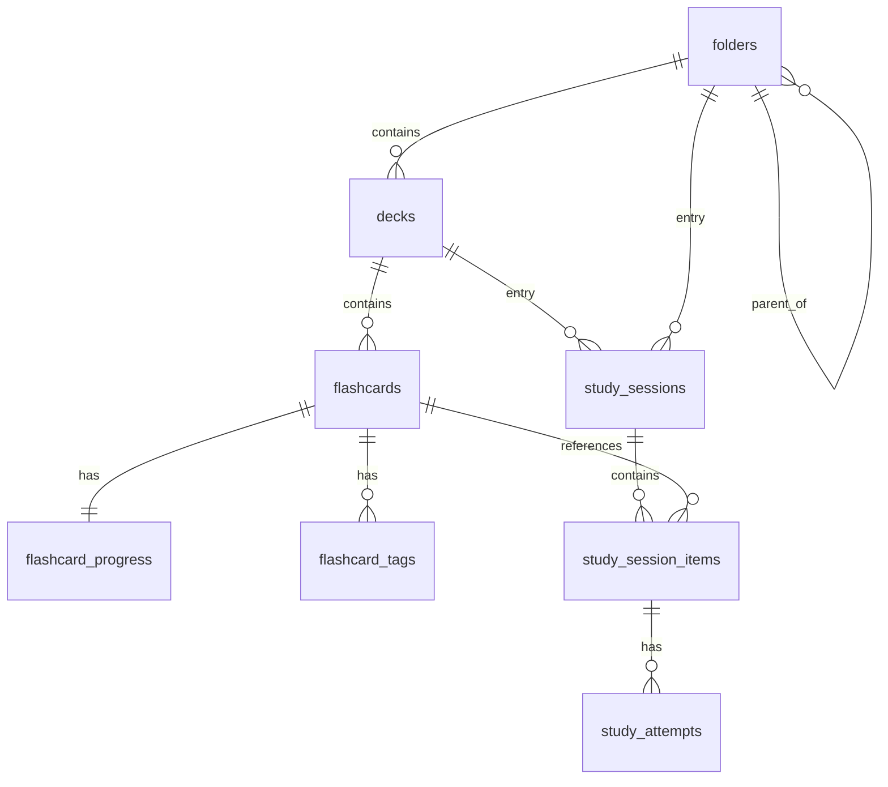

# Database Schema Contract

## Source files to inspect

- `lib/data/datasources/local/app_database.dart`
- `lib/data/datasources/local/database_schema_support.dart`
- `lib/data/datasources/local/tables/**`
- `lib/data/datasources/local/migrations/**`
- `lib/domain/entities/account_database_context.dart` (per-account DB file naming)

## Rules

- Drift is the local database layer.
- Current schema version: see `AppDatabase.currentSchemaVersion`.
- Foreign keys must stay enabled (`PRAGMA foreign_keys = ON`).
- WAL mode must stay enabled (`PRAGMA journal_mode = WAL`).
- Database must not run on UI isolate (use `driftDatabase(...)` from `drift_flutter` with `shareAcrossIsolates: true`).
- IDs are text (UUID-like, generated via `IdGenerator`).
- Enums are text.
- Timestamps are UTC epoch milliseconds.
- Generated Drift files must not be edited manually.

## Per-account database isolation

The Drift database file name is parameterized by the active account (see `docs/business/account-sync/account-sync.md`):

| Account context | Database file name |
| --- | --- |
| Guest (no link) | `{AppConstants.localDatabaseName}_guest` |
| Google account | `{AppConstants.localDatabaseName}_{normalizedSubjectId}` |

Implications:

- Every Drift schema rule applies independently per account database.
- Migrations run separately for each account file.
- Account link itself is NOT in Drift (it lives in SharedPreferences) — otherwise the app could not decide which DB to open at boot.
- Drive sync metadata, TTS settings (within a DB), and all entity data are scoped to the active account database.

## Target table areas

This table describes the target persistence contract. Some entries are ahead of the current implementation and require migration before feature implementation.

| Area | Table |
| --- | --- |
| Folders | `folders` |
| Decks | `decks`; `target_language` is Target / Migration Required per `docs/business/deck/deck-management.md` |
| Flashcards | `flashcards` |
| SRS progress | `flashcard_progress`; `buried_until`, `is_suspended`, and related fields are Target / Migration Required per `docs/business/study-actions/bury-suspend.md` |
| Tags | `flashcard_tags` |
| Sessions | `study_sessions` |
| Session items | `study_session_items` |
| Attempts | `study_attempts` |
| TTS settings | Target: `tts_settings` (single-row, id=`'default'`). If current implementation uses `tts_settings_records`, keep a mapper/migration note before renaming. |

## Settings stored outside Drift

These belong in SharedPreferences (not Drift), see business docs for rationale:

| Setting | Store | Spec |
| --- | --- | --- |
| Daily goal value | SharedPreferences (`study_settings_store.dart`) | `docs/business/engagement/dashboard-engagement.md` |
| Goal enabled toggle | SharedPreferences | `docs/business/engagement/dashboard-engagement.md` |
| Reminder time | SharedPreferences | `docs/business/engagement/dashboard-engagement.md` |
| Reminder enabled toggle | SharedPreferences | `docs/business/engagement/dashboard-engagement.md` |
| Longest streak | SharedPreferences | `docs/business/engagement/dashboard-engagement.md` |
| Last goal-met date | SharedPreferences | `docs/business/engagement/dashboard-engagement.md` |
| Recent searches | SharedPreferences | `docs/business/search/global-search.md` |
| Cloud account link | SharedPreferences | `docs/business/account-sync/account-sync.md` |
| Drive sync metadata | SharedPreferences | `docs/business/account-sync/account-sync.md` |
| Locale, theme mode | SharedPreferences | code-only |

Rationale: these are device-local user preferences. Putting them in Drift would require migrating them across per-account database switches. SharedPreferences naturally stays with the device.

## Pending schema changes

The following schema changes are required to implement new specs. Each requires a migration per `docs/database/migration-contract.md`.

### V1 migration gate

A pending column listed here does not automatically approve every dependent feature. Before coding, check `docs/checklist/v1-implementation-scope-2026-05-29.md` and `docs/checklist/screen-function-task-matrix.md`.

- `flashcard_progress.buried_until` and `flashcard_progress.is_suspended` are V1-approved only when the migration is part of the task.
- `flashcard_progress.last_reset_at`, `study_attempts.box_before`, and `study_attempts.box_after` are reserved for the Future Proposal Card History feature unless promoted.
- `decks.target_language` may be implemented only with the deck/TTS migration task that updates Drift schema, mapper, tests, and generated code.

| Change | Source spec | Notes |
| --- | --- | --- |
| Add `decks.target_language TEXT NOT NULL DEFAULT 'korean'` | `docs/business/deck/deck-management.md` | Migration backfills existing rows to `'korean'`. |
| Add `flashcard_progress.buried_until INTEGER NULL` | `docs/business/study-actions/bury-suspend.md` | Default null. |
| Add `flashcard_progress.is_suspended BOOL NOT NULL DEFAULT 0` | `docs/business/study-actions/bury-suspend.md` | Default false. |
| Add `flashcard_progress.last_reset_at INTEGER NULL` | `docs/business/history/card-history.md` | Default null. Updated when user resets a card's progress. |
| Add `study_attempts.box_before INTEGER NOT NULL DEFAULT 0` | `docs/business/history/card-history.md` | Migration backfill: set to 0 for pre-migration rows (treated as "unknown"; history view displays "—" for box transition on those rows). |
| Add `study_attempts.box_after INTEGER NOT NULL DEFAULT 0` | `docs/business/history/card-history.md` | Same migration semantics as `box_before`. |
| Consider compound index on `flashcard_progress(is_suspended, buried_until, due_at)` | `docs/business/study-actions/bury-suspend.md` | Profile before adding. |
| Consider compound index on `flashcard_tags(LOWER(tag), flashcard_id)` | `docs/business/tags/tag-system.md` | For tag filter performance. |
| Consider index on `study_attempts(box_after)` | `docs/business/history/card-history.md` | Only if box-progression analytics need it; profile first. |

When implementing, bump `AppDatabase.currentSchemaVersion` accordingly and update this doc's frontmatter `schema_version`.

### Migration ordering note

`box_before` / `box_after` migration must run BEFORE any new study session can record attempts, so the inserts include the new columns. The default `0` represents "unknown / pre-migration"; UI must render `0` as "—" not as "Box 0".

## Entity relationship overview

## Foreign key cascade rules

| Parent | Child | On delete |
| --- | --- | --- |
| `folders` (self) | `folders` | Restrict (no orphan via direct FK; cleanup in transaction) |
| `folders` | `decks` | Cascade |
| `decks` | `flashcards` | Cascade |
| `flashcards` | `flashcard_progress` | Cascade |
| `flashcards` | `flashcard_tags` | Cascade |
| `flashcards` | `study_session_items` | Cascade |
| `study_sessions` | `study_session_items` | Cascade |
| `study_session_items` | `study_attempts` | Cascade |

## Schema change checklist

- Update Drift table definition.
- Add migration.
- Update enum values when needed.
- Update repository/mapper.
- Update business docs.
- Update tests.
- Run build runner.
- Run guard.
- Run analyzer.

## Forbidden

- Do not edit generated database file manually.
- Do not rename enum values casually.
- Do not add new table without migration and docs.
- Do not duplicate SRS session tables when study session tables already represent review.
- Do not disable foreign keys.
- Do not change timestamp unit (must stay UTC epoch ms).

## Agent rule

When changing schema, always read `docs/database/migration-contract.md` first.

## Related

This schema is referenced by every business spec that touches persistent state.

**Per-table consumers:**

| Table | Primary business specs |
| --- | --- |
| `folders` | `docs/business/folder/folder-management.md` |
| `decks` (incl. `target_language` pending migration) | `docs/business/deck/deck-management.md`, `docs/business/tts/tts-settings.md` |
| `flashcards` | `docs/business/flashcard/flashcard-management.md` |
| `flashcard_progress` (incl. `buried_until`, `is_suspended`, `last_reset_at` pending migrations) | `docs/business/srs/srs-review.md`, `docs/business/study-actions/bury-suspend.md`, `docs/business/history/card-history.md` |
| `flashcard_tags` | `docs/business/tags/tag-system.md` |
| `study_sessions` | `docs/business/study/study-flow.md`, `docs/business/resume/resume-session.md` |
| `study_session_items` | `docs/business/study/study-flow.md` |
| `study_attempts` (incl. `box_before`, `box_after` pending migrations) | `docs/business/srs/srs-review.md`, `docs/business/history/card-history.md` |

**Related contracts:**
- `docs/database/migration-contract.md` — how schema changes ship
- `docs/database/storage-boundaries.md` — what lives in Drift vs SharedPreferences vs files
- `docs/architecture/clean-architecture-contract.md` — DAO/repository pattern

**Wireframes that depend on schema:**
- `docs/wireframes/06-flashcard-list.md` — filters consume status columns
- `docs/wireframes/09-flashcard-history.md` — timeline reads `study_attempts`
- `docs/wireframes/19-settings-account.md` — sync reads/writes whole DB

**Decision table:**
- `docs/decision-tables/memox-core-decision-table.md` rows under "Schema" (column existence, default values, NOT NULL)

**Source files to inspect:**
- `lib/data/datasources/local/tables/**`
- `lib/data/datasources/local/app_database.dart`
- `lib/data/datasources/local/migrations/**`
