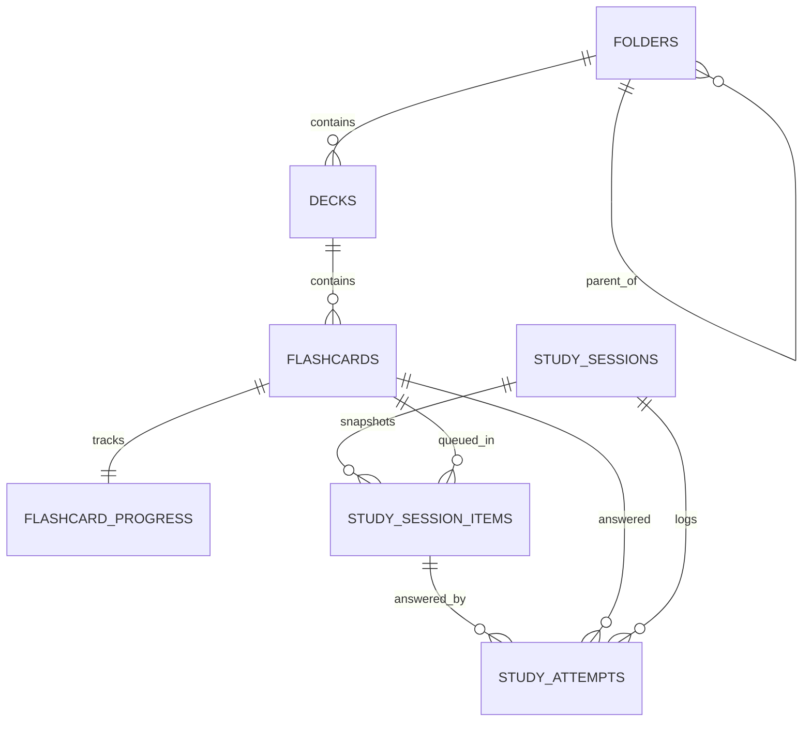

# Schema V1

## Design Rules
- Dùng `TEXT` id cho entity id
- Dùng `INTEGER` UTC epoch milliseconds cho mọi timestamp
- Dùng `TEXT` cho enum để migration đọc dễ hơn
- Bật foreign key và cascade delete ở các quan hệ chứa trực tiếp
- Các write nghiệp vụ quan trọng chạy trong transaction

## ERD

## 1. `folders`
| Column | Type | Null | Notes |
| --- | --- | --- | --- |
| `id` | TEXT | no | PK |
| `parent_id` | TEXT | yes | FK -> `folders.id`, nullable với folder root |
| `name` | TEXT | no | tên hiển thị |
| `content_mode` | TEXT | no | `unlocked`, `subfolders`, `decks` |
| `sort_order` | INTEGER | no | phục vụ reorder thủ công |
| `created_at` | INTEGER | no | UTC epoch ms |
| `updated_at` | INTEGER | no | UTC epoch ms |

### Constraint
- `parent_id` phải khác `id`
- Không cho tạo cycle ở tầng ứng dụng trước khi update `parent_id`
- `content_mode=subfolders` thì chỉ được chứa folder con
- `content_mode=decks` thì chỉ được chứa deck

## 2. `decks`
| Column | Type | Null | Notes |
| --- | --- | --- | --- |
| `id` | TEXT | no | PK |
| `folder_id` | TEXT | no | FK -> `folders.id` |
| `name` | TEXT | no | tên deck |
| `sort_order` | INTEGER | no | phục vụ reorder trong folder |
| `created_at` | INTEGER | no | UTC epoch ms |
| `updated_at` | INTEGER | no | UTC epoch ms |

### Derived, không lưu source of truth
- `card_count`
- `due_today_count`
- `last_studied_at`
- `mastery_percent`

## 3. `flashcards`
| Column | Type | Null | Notes |
| --- | --- | --- | --- |
| `id` | TEXT | no | PK |
| `deck_id` | TEXT | no | FK -> `decks.id` |
| `title` | TEXT | yes | optional, phục vụ sort/search |
| `front` | TEXT | no | mặt trước |
| `back` | TEXT | no | mặt sau |
| `note` | TEXT | yes | ghi chú thêm nếu có |
| `sort_order` | INTEGER | no | phục vụ manual reorder |
| `created_at` | INTEGER | no | UTC epoch ms |
| `updated_at` | INTEGER | no | UTC epoch ms |

### Rule
- Mỗi flashcard luôn thuộc đúng 1 deck
- Sort theo tên dùng `COALESCE(title, front)`
- Search ít nhất trên `title`, `front`, `back`

## 4. `flashcard_progress`
| Column | Type | Null | Notes |
| --- | --- | --- | --- |
| `flashcard_id` | TEXT | no | PK, FK -> `flashcards.id` |
| `current_box` | INTEGER | no | box SRS hiện tại, từ `1` đến `8`, mặc định `1` cho thẻ mới |
| `review_count` | INTEGER | no | số lượt đã chấm |
| `lapse_count` | INTEGER | no | số lần quên hoặc tụt box |
| `last_result` | TEXT | yes | raw result: `correct`, `incorrect`, `remembered`, `forgot` |
| `last_studied_at` | INTEGER | yes | UTC epoch ms |
| `due_at` | INTEGER | yes | UTC epoch ms, null khi chưa từng học |
| `created_at` | INTEGER | no | UTC epoch ms |
| `updated_at` | INTEGER | no | UTC epoch ms |

### Rule
- Mỗi flashcard có đúng 1 hàng progress
- `move flashcard` không đổi progress row
- `duplicate deck` và `import` tạo progress row mới
- Trạng thái `new`, `learning`, `due`, `overdue` là derived, không lưu cột riêng
- Mapping raw result sang nhánh SRS:
  - `correct` và `remembered` -> nhánh làm tốt
  - `incorrect` -> nhánh chưa tốt
  - `forgot` -> nhánh quên

## 5. `study_sessions`
| Column | Type | Null | Notes |
| --- | --- | --- | --- |
| `id` | TEXT | no | PK |
| `entry_type` | TEXT | no | `deck`, `folder`, `today` |
| `entry_ref_id` | TEXT | yes | id deck hoặc folder nếu có |
| `study_type` | TEXT | no | `new`, `due`, `mixed` |
| `study_mode` | TEXT | no | `review`, `match`, `guess`, `recall` |
| `batch_size` | INTEGER | no | snapshot setting khi tạo session |
| `shuffle_flashcards` | INTEGER | no | 0 hoặc 1 |
| `shuffle_answers` | INTEGER | no | 0 hoặc 1 |
| `prioritize_overdue` | INTEGER | no | 0 hoặc 1 |
| `status` | TEXT | no | `in_progress`, `completed`, `ended_early`, `restarted` |
| `started_at` | INTEGER | no | UTC epoch ms |
| `ended_at` | INTEGER | yes | UTC epoch ms |
| `restarted_from_session_id` | TEXT | yes | FK tự tham chiếu nếu session là kết quả restart |

### Rule
- `resume` chỉ load session có `status=in_progress`
- `restart` không sửa history cũ, mà tạo session mới
- UI label `Review` của study type được map vào giá trị schema `due`

## 6. `study_session_items`
| Column | Type | Null | Notes |
| --- | --- | --- | --- |
| `id` | TEXT | no | PK |
| `session_id` | TEXT | no | FK -> `study_sessions.id` |
| `flashcard_id` | TEXT | no | FK -> `flashcards.id` |
| `round_index` | INTEGER | no | `1` cho queue gốc, `2+` cho retry round |
| `queue_position` | INTEGER | no | thứ tự hiện tại trong round |
| `source_pool` | TEXT | no | `new`, `due`, `overdue`, `retry` |
| `status` | TEXT | no | `pending`, `completed`, `abandoned` |
| `completed_at` | INTEGER | yes | UTC epoch ms |

### Rule
- `skip` không tạo item mới, chỉ đổi `queue_position`
- `retry incorrect` tạo thêm item mới với `round_index` lớn hơn
- `resume` đọc các item `pending` theo `round_index`, `queue_position`
- Với session mixed, mỗi item vẫn mang `source_pool` thực tế là `new`, `due` hoặc `overdue`
- Nếu session kết thúc sớm, các item còn `pending` chuyển sang `abandoned`

## 7. `study_attempts`
| Column | Type | Null | Notes |
| --- | --- | --- | --- |
| `id` | TEXT | no | PK |
| `session_id` | TEXT | no | FK -> `study_sessions.id` |
| `session_item_id` | TEXT | no | FK -> `study_session_items.id` |
| `flashcard_id` | TEXT | no | FK -> `flashcards.id` |
| `result` | TEXT | no | raw result: `correct`, `incorrect`, `remembered`, `forgot` |
| `old_box` | INTEGER | yes | box trước khi chấm |
| `new_box` | INTEGER | yes | box sau khi chấm |
| `next_due_at` | INTEGER | yes | UTC epoch ms |
| `answered_at` | INTEGER | no | UTC epoch ms |

### Rule
- Chỉ ghi `study_attempts` cho lượt chấm thật
- `skip` không cập nhật SRS và không bắt buộc có row trong bảng này
- Session summary có thể derive từ bảng này hoặc snapshot ngược vào `study_sessions` khi kết thúc

## Derived Query, không tạo thêm source of truth
- Breadcrumb folder: recursive query từ `folders.parent_id`
- `library.deckCount`: tổng deck trong subtree của folder
- `library.itemCount`: tổng flashcard trong subtree của folder
- `deck.dueToday`: đếm `flashcard_progress.due_at <= end_of_today`
- `folder.lastStudiedAt`: `MAX(flashcard_progress.last_studied_at)` trong subtree
- `deck.lastStudiedAt`: `MAX(flashcard_progress.last_studied_at)` trong deck
- `masteryPercent`: tính từ progress, không lưu cố định

## Chưa đưa vào core schema v1
- tag table cho deck hoặc flashcard
- FTS virtual table
- cloze payload cho Fill mode
- sync metadata
- soft delete
