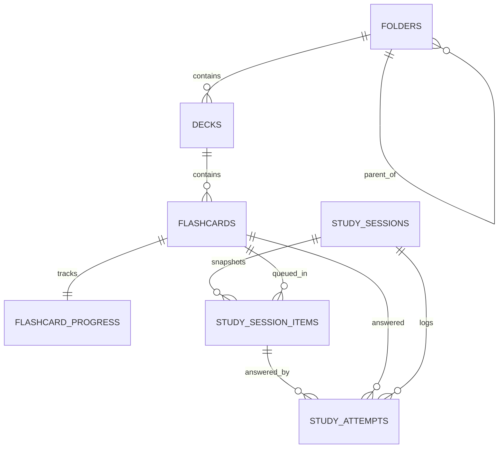

# Schema V1

## Design Rules
- Dùng `TEXT` id cho entity id
- Dùng `INTEGER` UTC epoch milliseconds cho mọi timestamp
- Dùng `TEXT` cho enum để migration đọc dễ hơn
- Bật foreign key và cascade delete ở các quan hệ chứa trực tiếp
- Các write nghiệp vụ quan trọng chạy trong transaction

## ERD

## 1. `folders`
| Column | Type | Null | Notes |
| --- | --- | --- | --- |
| `id` | TEXT | no | PK |
| `parent_id` | TEXT | yes | FK -> `folders.id`, nullable với folder root |
| `name` | TEXT | no | tên hiển thị |
| `content_mode` | TEXT | no | `unlocked`, `subfolders`, `decks` |
| `sort_order` | INTEGER | no | phục vụ reorder thủ công |
| `created_at` | INTEGER | no | UTC epoch ms |
| `updated_at` | INTEGER | no | UTC epoch ms |

### Constraint
- `parent_id` phải khác `id`
- Không cho tạo cycle ở tầng ứng dụng trước khi update `parent_id`
- `content_mode=subfolders` thì chỉ được chứa folder con
- `content_mode=decks` thì chỉ được chứa deck

## 2. `decks`
| Column | Type | Null | Notes |
| --- | --- | --- | --- |
| `id` | TEXT | no | PK |
| `folder_id` | TEXT | no | FK -> `folders.id` |
| `name` | TEXT | no | tên deck |
| `sort_order` | INTEGER | no | phục vụ reorder trong folder |
| `created_at` | INTEGER | no | UTC epoch ms |
| `updated_at` | INTEGER | no | UTC epoch ms |

### Derived, không lưu source of truth
- `card_count`
- `due_today_count`
- `last_studied_at`
- `mastery_percent`

## 3. `flashcards`
| Column | Type | Null | Notes |
| --- | --- | --- | --- |
| `id` | TEXT | no | PK |
| `deck_id` | TEXT | no | FK -> `decks.id` |
| `title` | TEXT | yes | optional, phục vụ sort/search |
| `front` | TEXT | no | mặt trước |
| `back` | TEXT | no | mặt sau |
| `note` | TEXT | yes | ghi chú thêm nếu có |
| `sort_order` | INTEGER | no | phục vụ manual reorder |
| `created_at` | INTEGER | no | UTC epoch ms |
| `updated_at` | INTEGER | no | UTC epoch ms |

### Rule
- Mỗi flashcard luôn thuộc đúng 1 deck
- Sort theo tên dùng `COALESCE(title, front)`
- Search ít nhất trên `title`, `front`, `back`

## 4. `flashcard_progress`
| Column | Type | Null | Notes |
| --- | --- | --- | --- |
| `flashcard_id` | TEXT | no | PK, FK -> `flashcards.id` |
| `current_box` | INTEGER | no | box SRS hiện tại, từ `1` đến `8`, mặc định `1` cho thẻ mới |
| `review_count` | INTEGER | no | số lần cập nhật SRS chính thức |
| `lapse_count` | INTEGER | no | số lần quên hoặc tụt box trong các lượt SRS chính thức |
| `last_result` | TEXT | yes | kết quả SRS chính thức gần nhất; với SRS Review dùng `perfect`, `recovered`, hoặc `forgot` |
| `last_studied_at` | INTEGER | yes | UTC epoch ms của lần cập nhật SRS chính thức gần nhất |
| `due_at` | INTEGER | yes | UTC epoch ms chính thức, null khi chưa pass New Study đủ 5 mode |
| `created_at` | INTEGER | no | UTC epoch ms |
| `updated_at` | INTEGER | no | UTC epoch ms |

### Rule
- Mỗi flashcard có đúng 1 hàng progress
- `move flashcard` không đổi progress row
- `duplicate deck` và `import` tạo progress row mới
- Trạng thái `new`, `learning`, `due`, `overdue` là derived, không lưu cột riêng
- New Study chỉ commit `flashcard_progress` khi New Study session chuyển sang `completed`
- SRS Review chỉ commit `flashcard_progress` khi SRS Review session chuyển sang `completed`
- Khi session còn đang chạy, thay đổi box và `due_at` chỉ được stage từ `study_attempts` và `study_session_items`
- Khi SRS Review còn đang chạy, không cập nhật `current_box`, `due_at`, `review_count`, `last_result`, hoặc trạng thái SRS cuối cùng
- SRS Review không cập nhật `flashcard_progress` khi user đang trả lời, flashcard vừa đúng, flashcard vừa sai, retry batch chưa rỗng hoặc Fill mode chưa hoàn thành
- Các kết quả fail hoặc retry trong New Study khi chưa pass đủ 5 mode chỉ nằm trong `study_attempts` và `study_session_items`
- Các kết quả fail hoặc retry trong SRS Review trước khi Fill mode kết thúc chỉ nằm trong `study_attempts` và `study_session_items`
- Mapping raw result sang nhánh SRS:
  - `correct` và `remembered` -> nhánh làm tốt
  - `incorrect` -> nhánh chưa tốt
  - `forgot` -> nhánh quên

## 5. `study_sessions`
| Column | Type | Null | Notes |
| --- | --- | --- | --- |
| `id` | TEXT | no | PK |
| `entry_type` | TEXT | no | `deck`, `folder`, `today` |
| `entry_ref_id` | TEXT | yes | id deck hoặc folder nếu có |
| `study_type` | TEXT | no | `new`, `srs_review` |
| `study_flow` | TEXT | no | `new_full_cycle`, `srs_fill_review` |
| `batch_size` | INTEGER | no | snapshot batch size hiệu lực khi tạo session |
| `shuffle_flashcards` | INTEGER | no | 0 hoặc 1 |
| `shuffle_answers` | INTEGER | no | 0 hoặc 1 |
| `prioritize_overdue` | INTEGER | no | 0 hoặc 1 |
| `status` | TEXT | no | `draft`, `in_progress`, `ready_to_finalize`, `completed`, `failed_to_finalize`, `cancelled` |
| `started_at` | INTEGER | no | UTC epoch ms |
| `ended_at` | INTEGER | yes | UTC epoch ms |
| `restarted_from_session_id` | TEXT | yes | FK tự tham chiếu nếu session là kết quả restart |

### Rule
- Session status phải đi theo chuỗi hợp lệ:
  - `draft` → `in_progress` (khi user bắt đầu học)
  - `in_progress` → `ready_to_finalize` (khi pass đủ điều kiện học, retry batch rỗng ở mode cuối)
  - `ready_to_finalize` → `completed` (finalize thành công)
  - `ready_to_finalize` → `failed_to_finalize` (finalize transaction rollback)
  - `failed_to_finalize` → `completed` (retry finalize thành công)
  - bất kỳ non-terminal state nào → `cancelled` (user hủy hoặc kết thúc sớm)
- `resume` load session ở trạng thái `in_progress`, `ready_to_finalize`, hoặc `failed_to_finalize`
- `restart` không sửa history cũ, mà tạo session mới; session cũ được đánh dấu `cancelled` và new session giữ `restarted_from_session_id` trỏ về session cũ (session cũ xem như superseded)
- Session `completed` là terminal — không được quay lại trạng thái khác
- UI label `SRS Review` của study type được map vào giá trị schema `srs_review`
- `study_type=new` dùng `study_flow=new_full_cycle` và chạy đủ 5 mode theo thứ tự `review`, `match`, `guess`, `recall`, `fill`
- `study_type=srs_review` dùng `study_flow=srs_fill_review` và chỉ chạy `fill`
- Mode hiện tại được xác định từ `study_session_items.mode_order`, `study_session_items.study_mode` và các item còn `pending`

## 6. `study_session_items`
| Column | Type | Null | Notes |
| --- | --- | --- | --- |
| `id` | TEXT | no | PK |
| `session_id` | TEXT | no | FK -> `study_sessions.id` |
| `flashcard_id` | TEXT | no | FK -> `flashcards.id` |
| `study_mode` | TEXT | no | mode của item: `review`, `match`, `guess`, `recall`, `fill` |
| `mode_order` | INTEGER | no | thứ tự mode trong flow, `1..5` cho New Study và `1` cho SRS Review |
| `round_index` | INTEGER | no | `1` cho queue gốc, `2+` cho retry round |
| `queue_position` | INTEGER | no | thứ tự hiện tại trong round |
| `source_pool` | TEXT | no | `new`, `due`, `overdue`, `retry` |
| `status` | TEXT | no | `pending`, `completed`, `abandoned` |
| `completed_at` | INTEGER | yes | UTC epoch ms |

### Rule
- `skip` không tạo item mới, chỉ đổi `queue_position`
- New Study `retry incorrect` tạo thêm item mới với cùng `study_mode`, cùng `mode_order` và `round_index` lớn hơn
- SRS Review `retry incorrect` tạo thêm item mới với `study_mode=fill`, `mode_order=1` và `round_index` lớn hơn
- Retry round không có số lượt tối đa; điều kiện dừng duy nhất là không còn item `pending` có `source_pool=retry` trong mode hiện tại (`retryBatch.isEmpty`)
- `resume` đọc các item `pending` theo `mode_order`, `round_index`, `queue_position`
- Nếu session chuyển `cancelled`, các item còn `pending` chuyển sang `abandoned`
- `completed` nghĩa là item đã có lượt trả lời, không tự đồng nghĩa với pass mode
- Pass hoặc fail của item được xác định từ `study_attempts.result`
- New Study chỉ tạo item cho mode tiếp theo sau khi toàn bộ flashcard đã pass mode hiện tại
- New Study mode mới dùng lại batch flashcard gốc của session
- SRS Review chuyển session sang `ready_to_finalize` khi toàn bộ flashcard trong batch pass Fill và retry batch rỗng

## 7. `study_attempts`
| Column | Type | Null | Notes |
| --- | --- | --- | --- |
| `id` | TEXT | no | PK |
| `session_id` | TEXT | no | FK -> `study_sessions.id` |
| `session_item_id` | TEXT | no | FK -> `study_session_items.id` |
| `flashcard_id` | TEXT | no | FK -> `flashcards.id` |
| `attempt_number` | INTEGER | no | thứ tự attempt của flashcard trong session và mode hiện tại |
| `result` | TEXT | no | raw result: `correct`, `incorrect`, `remembered`, `forgot` (reserved cho mở rộng sau: `skipped`, `timeout`, `partially_correct`) |
| `old_box` | INTEGER | yes | box trước khi commit SRS chính thức, chỉ điền trong bước commit cuối session |
| `new_box` | INTEGER | yes | box sau khi commit SRS chính thức, chỉ điền trong bước commit cuối session |
| `next_due_at` | INTEGER | yes | UTC epoch ms chính thức, chỉ điền trong bước commit cuối session |
| `answered_at` | INTEGER | no | UTC epoch ms |

### Rule
- Chỉ ghi `study_attempts` cho lượt chấm thật
- Mỗi lần user trả lời phải ghi `attempt_number`
- `attempt_number` dùng để thống kê, xác định flashcard có từng sai trong session không, và tính kết quả SRS cuối session
- `skip` không cập nhật SRS và không bắt buộc có row trong bảng này
- New Study attempt chưa làm flashcard pass đủ 5 mode không cập nhật `flashcard_progress`
- New Study attempt làm flashcard pass đủ 5 mode chỉ tạo dữ liệu đủ điều kiện để commit cuối session
- SRS Review attempt trước khi Fill mode kết thúc không cập nhật `flashcard_progress`
- SRS Review khi Fill mode kết thúc và retry batch rỗng chỉ tạo dữ liệu đủ điều kiện để commit cuối session
- SRS Review flashcard từng sai trong Fill mode bằng `incorrect` có review result `recovered` và được commit theo nhánh giảm box hoặc due sớm hơn
- SRS Review flashcard từng `forgot` trong Fill mode có review result `forgot` và finalize đưa box về `1`
- SRS Review flashcard pass Fill mà không sai có review result `perfect` và được commit theo nhánh làm tốt
- `old_box`, `new_box`, `next_due_at` chỉ được ghi khi session chuyển sang `completed`
- Commit cuối session phải cập nhật `study_attempts` và `flashcard_progress` trong cùng transaction nghiệp vụ
- SRS Review finalize phải tổng hợp attempt của từng flashcard trước khi tính review result cuối cùng
- Nếu một flashcard cập nhật lỗi khi finalize, rollback toàn bộ cập nhật SRS và chuyển session sang `failed_to_finalize` (không phải `completed`)
- Session `failed_to_finalize` có thể retry finalize; nếu thành công thì chuyển `completed`
- Session summary có thể derive từ bảng này hoặc snapshot ngược vào `study_sessions` khi kết thúc

## Derived Query, không tạo thêm source of truth
- Breadcrumb folder: recursive query từ `folders.parent_id`
- `library.deckCount`: tổng deck trong subtree của folder
- `library.itemCount`: tổng flashcard trong subtree của folder
- `deck.dueToday`: đếm `flashcard_progress.due_at <= end_of_today`
- `folder.lastStudiedAt`: `MAX(flashcard_progress.last_studied_at)` trong subtree
- `deck.lastStudiedAt`: `MAX(flashcard_progress.last_studied_at)` trong deck
- `masteryPercent`: tính từ progress, không lưu cố định

## Chưa đưa vào core schema v1
- tag table cho deck hoặc flashcard
- FTS virtual table
- cloze payload nâng cao cho Fill mode
- sync metadata
- soft delete
